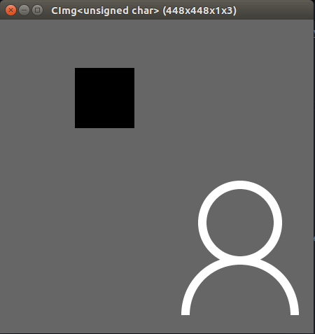
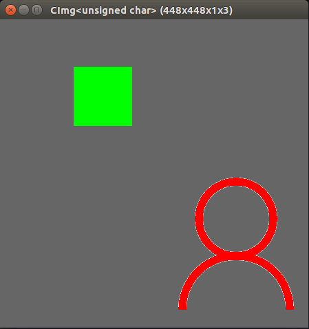
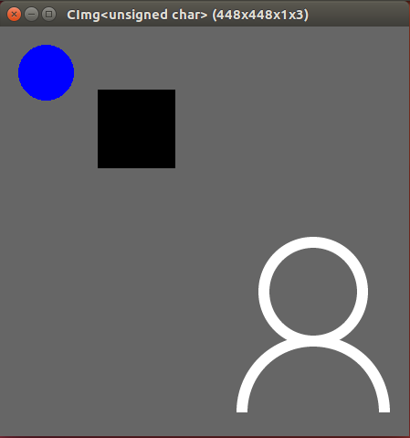
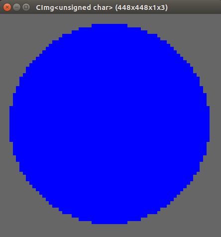
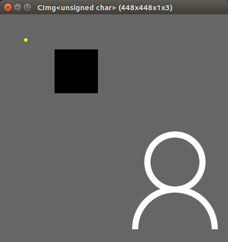
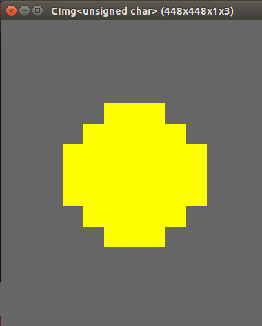

# Ex1 Image Display & Pixel Operations

This project read a BMP image and display it on the screen directly or after doing some operations on pixels.

## Test Environment

Operating System: Ubuntu 16.04.1 LTS
Compiler:  Linux version 4.4.0-116-generic (buildd@lgw01-amd64-021) (gcc version 5.4.0 20160609 (Ubuntu 5.4.0-6ubuntu1~16.04.9) )
test tool: googletest

## Test Data

Images: ./images/1.bmp

## Test Result

We divide the test into two parts: run the program and use googletest to check each function.

### Run

```shell
./hw1_main

+---------------------------------+
|     My Little CImg Program      |
+---------------------------------+

      0. Exit                      
      1. Display the image         
      2. Change color of some area
      3. Paint a blue circle       
      4. Paint a yellow circle     

Please enter your choice (0-4):
```

#### Task 1: Display the image

Enter 1, we get the original image:



#### Task 2: Change the white area to red and the black area to green

Enter 2, we change the color of corresponding areas in the image:



#### Task 3: Draw a blue circle at (50, 50) with radius 30

Enter 3, we draw a blue circle at (50, 50) in the image:



The blue circle's effect:



#### Task 4: Draw a yellow circle at (50, 50) with radius 3

Enter 4, we draw a yellow circle at (50, 50) in the image:



The yellow circle's effect:



### Googletest

In this part, we use googletest to test the total 4 functions corresponding to the 4 tasks:

```c++
CImg<unsigned char> img("./images/1.bmp");
EXPECT_EQ(true, task1(img));
EXPECT_EQ(true, task2(img));
EXPECT_EQ(true, task3(img));
EXPECT_EQ(true, task4(img));
```

And the result shows that all the functions work correctly:

```shell
./hw1_test

[==========] Running 1 test from 1 test case.
[----------] Global test environment set-up.
[----------] 1 test from GcdTest
[ RUN      ] GcdTest.IntTest
CImg<unsigned char> (448x448x1x3): this = 0x7ffea2329bf0, size = (448,448,1,3) [588 Kio], data = (unsigned char*)0x7fd0ae848010..0x7fd0ae8db00f (non-shared) = [ 102 102 102 102 102 102 102 102 ... 102 102 102 102 102 102 102 102 ], min = 0, max = 255, mean = 103.318, std = 33.5957, coords_min = (107,69,0,0), coords_max = (339,230,0,0).
CImg<unsigned char> (448x448x1x3): this = 0x7ffea2329c10, size = (448,448,1,3) [588 Kio], data = (unsigned char*)0x23a29f0..0x24359ef (non-shared) = [ 102 102 102 102 102 102 102 102 ... 102 102 102 102 102 102 102 102 ], min = 0, max = 255, mean = 101.22, std = 31.9812, coords_min = (107,69,0,0), coords_max = (339,230,0,0).
CImg<unsigned char> (448x448x1x3): this = 0x7ffea2329c30, size = (448,448,1,3) [588 Kio], data = (unsigned char*)0x23a29f0..0x24359ef (non-shared) = [ 102 102 102 102 102 102 102 102 ... 102 102 102 102 102 102 102 102 ], min = 0, max = 255, mean = 103.072, std = 36.6454, coords_min = (45,20,0,0), coords_max = (339,230,0,0).
CImg<unsigned char> (448x448x1x3): this = 0x7ffea2329c50, size = (448,448,1,3) [588 Kio], data = (unsigned char*)0x23a29f0..0x24359ef (non-shared) = [ 102 102 102 102 102 102 102 102 ... 102 102 102 102 102 102 102 102 ], min = 0, max = 255, mean = 103.331, std = 33.6475, coords_min = (107,69,0,0), coords_max = (49,47,0,0).
[       OK ] GcdTest.IntTest (6444 ms)
[----------] 1 test from GcdTest (6444 ms total)

[----------] Global test environment tear-down
[==========] 1 test from 1 test case ran. (6444 ms total)
[  PASSED  ] 1 test.
```

## Result Analysis

We can see that all the operations are correctly done through the images displayed. However, there are something we should note: the painting effect of circle in task 3 is better than that in task 4. The reason is that all the graphs drew on the screen are formed by pixels, which are small rectangles in different color. Thus, the edge of circle is also formed by many rectangular pixels, which explains that why the edge is zigzag when we enlarge the circles on the screen. When the circle's radius is large, there are more pixels to form the edge and make the edge more smooth, meaning that the circle's effect is better. On the contrary, when the circle's radius is small, the edge consists of fewer pixels and becomes more zigzag, meaning that the circle's effect is worse. Therefore, the painting effect of circle in task 3 is better than that in task 4 because the circle in task 3 has larger radius.
