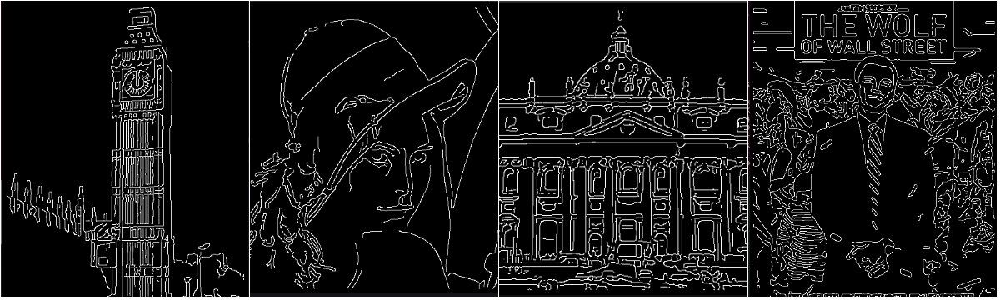
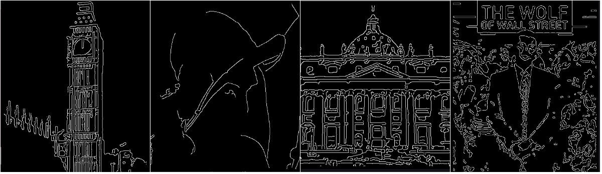
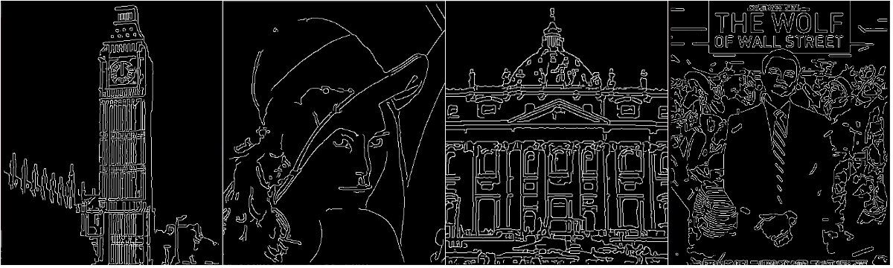
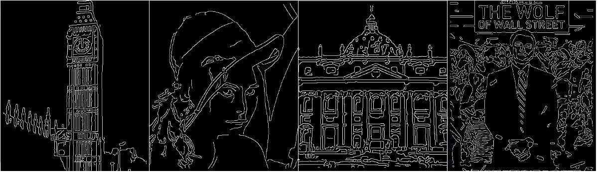
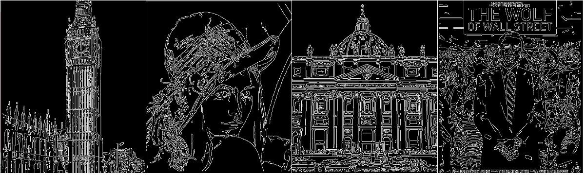
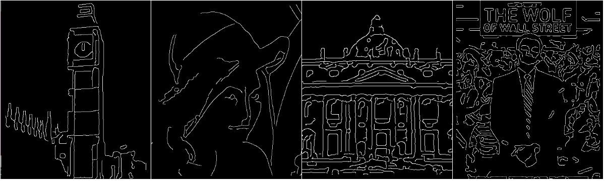
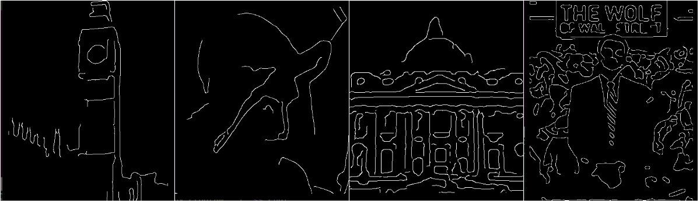
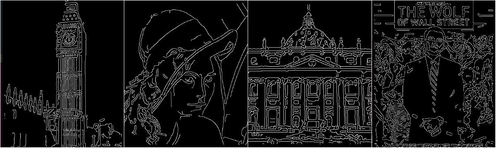
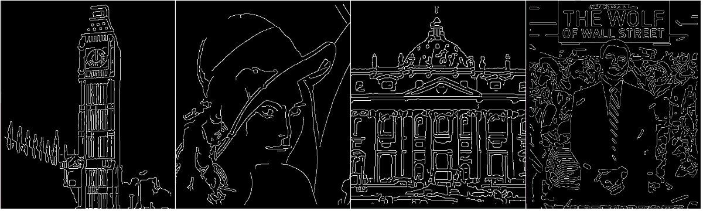
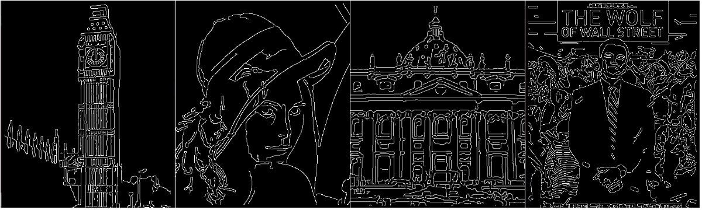

# Ex2 Package Canny Edge Detector Library

This project encapsulates the given source code of `canny` edge detector. Then we use the packaged library to test the four images and analyze how the parameters of `canny` detector affect the edge detection.

## Test Environment

+ Operating System: Ubuntu 16.04.1 LTS
+ Compiler: Linux version 4.4.0-116-generic (buildd@lgw01-amd64-021) (gcc version 5.4.0 20160609 (Ubuntu 5.4.0-6ubuntu1~16.04.9) )

## Test Data

Images:

+ ./images/bigben.bmp
+ ./images/lena.bmp
+ ./images/stpietro.bmp
+ ./images/twows.bmp

## Packaging

After packaging, we create two class, `imageIO` class for reading source images and outputting corresponding grey images, and `canny` class for detecting the edges. We only provide four interfaces to users, which work like this:

```c++
// read the source image
imageIO img(filename);
// get the grey image
CImg<unsigned char> grey = img.getGreyImg();
// canny detector
canny edge(grey, lowThreshold, highthreshold, gaussiankernelradius, gaussiankernelwidth, contrastnormalised);
// get edge image
CImg<unsigned char> rst = edge.getEdgeImg();
// display the edge image
rst.display();
```

We use the `CImg` Library to implement all the IO and other operations of images.

## Test Result

### Build

```shell
g++ -Wall -o main main.cpp CImg.h canny.h canny.cpp -lpthread -lX11
```

### Run

```shell
$ ./main

+---------------------------------+
|     My Packaged Canny Program   |
+---------------------------------+

      0. Exit                      
      1. bigben                    
      2. lena                      
      3. stpietro                  
      4. twows                     

Please choose your image (0-4):
```

We use the following four images (marked 1~4 from left to right) to test our program and analyze how the parameters of `canny` affect the edge detection.


After choosing image for edge detection, we first convert the image to its gray image.


There are mainly 5 parameters in the `canny` detector (i.e. `low threshold`, `high threshold`, `Gaussian kernel radius`, `Gaussian kernel width` and `contrast normalization`). Next, we detect each gray image's edge with different values of these  parameters and compare the results.

### Default Values

The default values of those parameters are `low threshold = 2.5f`, `high threshold = 7.5f`, `Gaussian kernel radius = 2.0f`, `Gaussian kernel width = 16` and `contrast normalization = 0`. The edge images detected with default values are as follows.



Considering the default edge images as reference result, we change the value of each parameter in turn and compare the result with the default edge images.

### Contrast Normalization

We set `contrast normalization = 1` while remain the default values of other parameters unchanged, implying that the detector construct the edge images after normalizing the contrast of the source images first.

The result images with contrast normalization:



The reference images without contrast normalization:


Comparing the two results, we can find that contrast normalization make the detector fail to detect some important edges and details (see the first and the second images) while probably detecting more noise (see the fourth image). Therefore, for our test images, contrast normalization will worsen the edge detection.

### Gaussian Kernel Width

Remaining the default values of other parameters unchanged, we set `Gaussian kernel width = 4, 9, 16, 25` respectively.

The result images with `Gaussian kernel width = 4`:



The result images with `Gaussian kernel width = 9`:



The result images with `Gaussian kernel width = 16`:


The result images with `Gaussian kernel width = 25`:


Comparing the results above, we find that all the results are close to each other. When `Gaussian kernel width = 4`, some details are loss (see the second image), but it has little effect on the edge images. Hence, it seems that the `Gaussian kernel width` parameter has little influence on the edge detection of our test images.

### Gaussian Kernel Radius

Remaining the default values of other parameters unchanged, we set `Gaussian kernel radius = 1, 2, 3, 4` respectively.

The result images with `Gaussian kernel radius = 1`:



The result images with `Gaussian kernel radius = 2`:


The result images with `Gaussian kernel radius = 3`:



The result images with `Gaussian kernel radius = 4`:



Comparing the results above, we can conclude that the smaller `Gaussian kernel radius` is, the more details and edges are detected while the more noise will also be detected. The larger `Gaussian kernel radius` is, the less details, edges and even little noise are detected. Since small kernel radius will cause more noise and large kernel radius will lead to important edges loss, we should choose the proper kernel radius for better detection (2 is the better kernel radius  for our test images).

### High Threshold

Remaining the default values of other parameters unchanged, we set `high threshold = 6, 7.5, 9` respectively.

The result images with `high threshold = 6`:



The result images with `high threshold = 7.5`:


The result images with `high threshold = 9`:



Comparing the results above, we can find that the lower `high threshold` is, the more details and edges are detected while the more noise will also be detected. The higher `high threshold` is, the less details, edges and even little noise are detected (see the second and fourth images). For our test images, 7.5 is better high threshold.

### Low Threshold

Remaining the default values of other parameters unchanged, we set `high threshold = 1, 2.5, 4` respectively.

The result images with `low threshold = 1`:



The result images with `low threshold = 2.5`:


The result images with `low threshold = 4`:


Comparing the results above, we can find that the lower `low threshold` is, the more details and edges are detected while the more noise will also be detected. The higher `low threshold` is, the smoother the edge images are and the less details and edges are detected. For our test images, 2.5 is better low threshold.

## Conclusion

From our test result we find that the `Gaussian kernel radius` is the most influential parameter of the `canny` detector. As a result, it's essential to give a proper `Gaussian kernel radius` when applying `canny` detector for edge detection.
