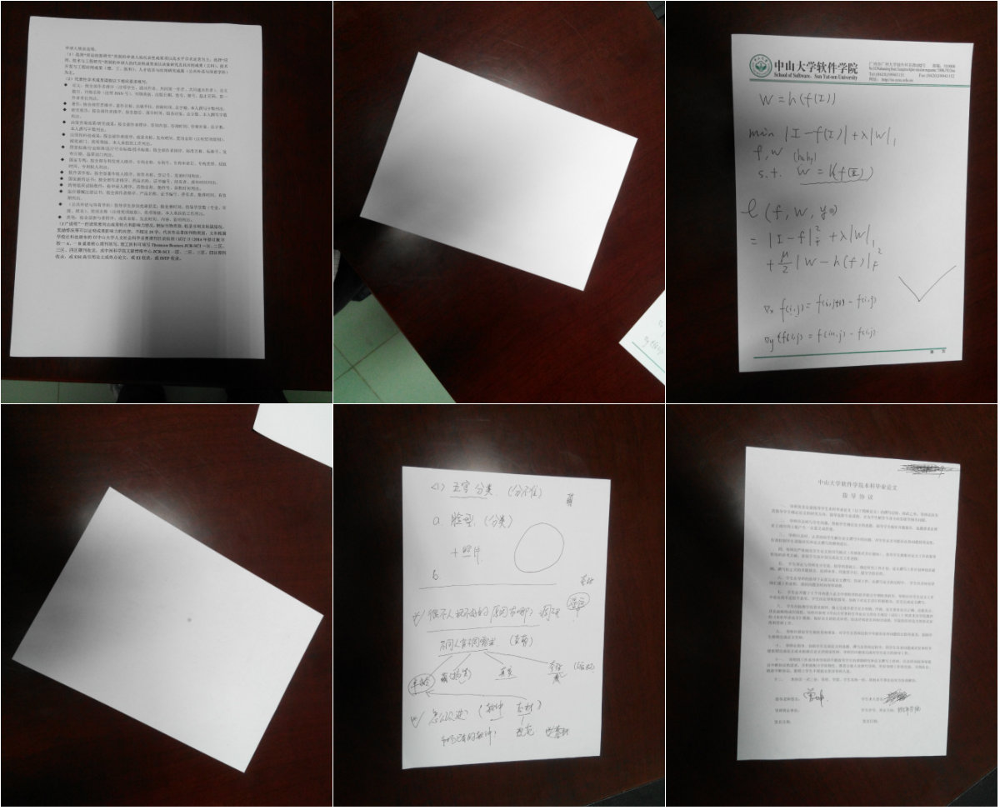

# Ex4 A4 Paper Correction

This project corrects the A4 papers from the given photos. The aspect ratio of each corrected A4 paper approximates the standard aspect ratio of ordinary A4 paper.

## Test Environment

+ Operating System: Ubuntu 16.04.1 LTS
+ Compiler: Linux version 4.4.0-116-generic (buildd@lgw01-amd64-021) (gcc version 5.4.0 20160609 (Ubuntu 5.4.0-6ubuntu1~16.04.9) )

## Test Data

Images:

+ ./images/A4_1.bmp
+ ./images/A4_2.bmp
+ ./images/A4_3.bmp
+ ./images/A4_4.bmp
+ ./images/A4_5.bmp
+ ./images/A4_6.bmp

## Correction

We first change the original image into gray image, and then get its edge image using prewitt edge detector. Next, we extract the four edge lines of the A4 paper from the edge image and find the positions of the four vertices. Finally, we use image morphing and inverse warping to correct the A4 paper in the image.

```c++
// read the source image
imageIO img(filename);
// get the source image and gray image
CImg<double> src = img.getSrcImg();
CImg<double> grey = img.getGreyImg();
// prewitt detector
prewitt edge(grey, blur, grad);
// get edge image
CImg<double> edgeImg = edge.getEdgeImg();
// extract the edge of the A4 paper
A4EdgeExtract edgeEct(src, edgeImg, diff, threshold);
// get the result image with four vertices of A4 paper marked
CImg<double> resultImg = edgeEct.getResultImg();
// get the four vertices position
vector<point*> v = edgeEct.getIntersections();
// correct the A4 paper of original image
A4Correct cr(src, v);
// get the corrected image
CImg<double> targetImg = cr.getTargetImg();

// display the result image and the corrected A4 paper
resultImg.display();
targetImg.display();
```

We use the `CImg` library to implement all the IO and other operations of images.

## Test Result

### Build

```shell
g++ -Wall -o main main.cpp hw3_1.h CImg.h prewitt.h correction.h -lpthread -lX11
```

### Run

```shell
$ ./main
+---------------------------------+
|    My edge extraction Program   |
+---------------------------------+

      0. Exit                      
      1. A4_1 image                
      2. A4_2 image                
      3. A4_3 image                
      4. A4_4 image                
      5. A4_5 image                
      6. A4_6 image                

Please choose your image (0-6):
```

We use the following 6 images (marked 1~6 from left to right, top to bottom) to test out program and calculate the aspect ratio of each corrected A4 paper to compare it with the standard aspect ratio.


