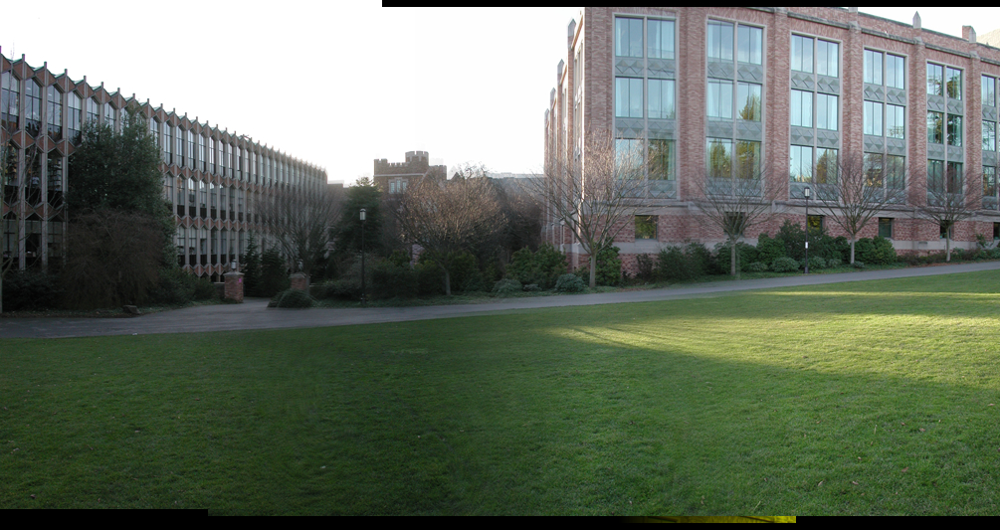
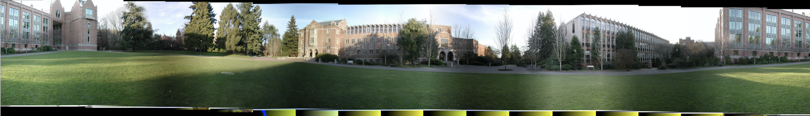

# Ex6 Images Stitching

This project stitches all given images to a large image. We use two data set to test our project and prove that it works well.

## Test Environment

+ Operating System: Ubuntu 16.04.1 LTS
+ Compiler: Linux version 4.4.0-116-generic (buildd@lgw01-amd64-021) (gcc version 5.4.0 20160609 (Ubuntu 5.4.0-6ubuntu1~16.04.9) )

## Test Data

./images1/
./images2/

## Algorithm

1. Take pictures on a tripod (or handheld)
2. Warp images to spherical coordinates
3. Extract features
4. Align neighboring pairs using RANSAC
5. Write out list of neighboring translations
6. Correct for drift
7. Read in warped images and blend them
8. Crop the result and import into a viewer

## Test Result

### Data Set 1

For the first data set, the stitched image is:

### Data Set 2

For the second data set, the stitched image is:

## Conclusion

From the test result we can conclude that we implement the stitching project correctly. However, there are something blurry on the border of the stitched images, and the light is not even. Further tasks should be done to deal with these problems.
