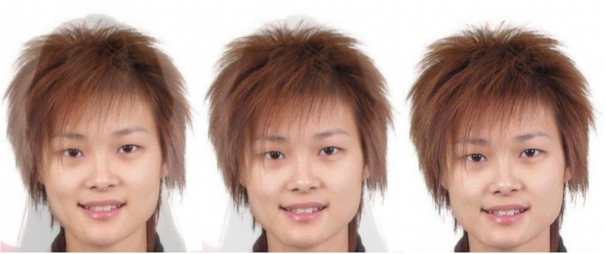

# Extra Assignment: Face Morphing

This project use image morphing algorithm to gradually change the face of one person into the face of another person. We use the 11 middle images with `rate = [0.0, 0.1, 0.2, 0.3, 0.4, 0.5, 0.6, 0.7, 0.8, 0.9, 1.0]` to form the final gif image.

## Test Environment

+ Operating System: Ubuntu 16.04.1 LTS
+ Compiler: Linux version 4.4.0-116-generic (buildd@lgw01-amd64-021) (gcc version 5.4.0 20160609 (Ubuntu 5.4.0-6ubuntu1~16.04.9) )

## Test Data

We use three pairs of faces to test our program.

### Pair 1

./testData/data1/man.bmp
./testData/data1/girl.bmp

### Pair 2

./testData/data2/man.bmp
./testData/data2/woman.bmp

### Pair 3

./testData/data3/woman.bmp
./testData/data3/chun.bmp

## Process

We first get the control points of the two faces in a pair by using [Face++ online API](https://www.faceplusplus.com.cn/face-detection/#demo). And then we calculate the corresponding control triangles in the two faces. Finally, we use image morphing methods to get the 11 middle images with the `rate` between `[0.0, 1.0]`.

## Test Result

### Pair 1

The 11 middle images of pair 1 is as follows:

And the animation is:

### Pair 2

The 11 middle images of pair 2 is as follows:

And the animation is:

### Pair 3

The 11 middle images of pair 3 is as follows:

And the animation is:

## Conclusion

From the test result we can conclude that we correctly implement the face morphing project.
